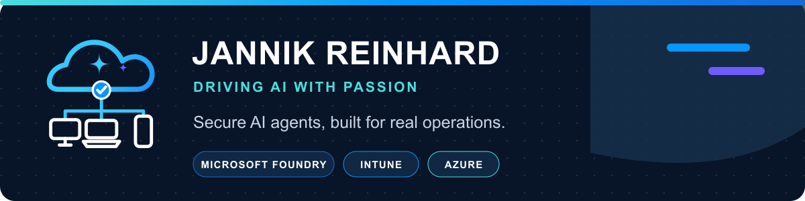

<!-- jr-brand:start -->

  
  <h1>Jannik Reinhard</h1>
  
<strong>I help enterprises ship secure AI agents | Head of AI @ Epic Fusion | 5x Microsoft MVP (AI Platform + Security) | Microsoft Foundry · Intune · Azure</strong>

  

  
  
  
  
  
  

  
Driving AI with passion · Microsoft Foundry · Intune · Azure

<!-- jr-brand:end -->

**Head of AI at [Epic Fusion](https://epicfusion.com) · 5x Microsoft MVP for AI Platform and Security · Microsoft Certified Trainer**

I build practical AI agents and endpoint automation for Microsoft environments. My work spans open-source Intune tooling, Microsoft Foundry patterns, talks, and production AI systems. I publish the implementation details so other teams can build without me.

## Current Focus

- Agentic workflows for endpoint and IT operations
- Microsoft Foundry architecture, orchestration, observability, and governance
- Open tooling for the Intune and Microsoft 365 community
- Practical technical writing, books, and conference sessions

## Selected Open Source

- [Endpoint Analytics Remediation Scripts](https://github.com/JayRHa/EndpointAnalyticsRemediationScripts) — production-ready Intune detection and remediation packages
- [Intune Scripts](https://github.com/JayRHa/IntuneScripts) — practical PowerShell automation for Intune administrators
- [Agent Skills](https://github.com/JayRHa/AgentSkills) — community-driven skills for Codex, Claude, Gemini CLI, Cursor, and other agents
- [Document Manager](https://github.com/JayRHa/DocumentManager) — self-hosted, AI-assisted document management
- [Microsoft Foundry book code](https://github.com/JayRHa/foundry-book-code) — runnable examples for agents, infrastructure, evaluation, and operations
- [AI, Automation and Analytics book code](https://github.com/JayRHa/intune-aaa-book-code) — Microsoft Graph, KQL, Device Query, automation, grounding, and Foundry examples

Explore the full collection in my [repositories](https://github.com/JayRHa?tab=repositories).

## Writing and Speaking

I publish hands-on guidance at [jannikreinhard.com](https://jannikreinhard.com) and short Microsoft admin notes at [msnugget.com](https://msnugget.com). I speak about Intune, Microsoft Foundry, AI agents, and automation at community and industry events.

## Core Technologies

`Microsoft Intune` · `Microsoft Graph` · `Microsoft Foundry` · `Azure AI` · `PowerShell` · `Python` · `Terraform` · `GitHub Actions`

> If I touch it twice, I automate it once.

<!-- jr-brand-footer:start -->

---

  
Built and maintained by <a href="https://jannikreinhard.com/">Jannik Reinhard</a> · 5x Microsoft MVP for AI Platform and Security.

  
<a href="https://www.buymeacoffee.com/jannikreinf">Support the open-source work</a>

  
<strong>Stay healthy, Cheers Jannik</strong>

<!-- jr-brand-footer:end -->
